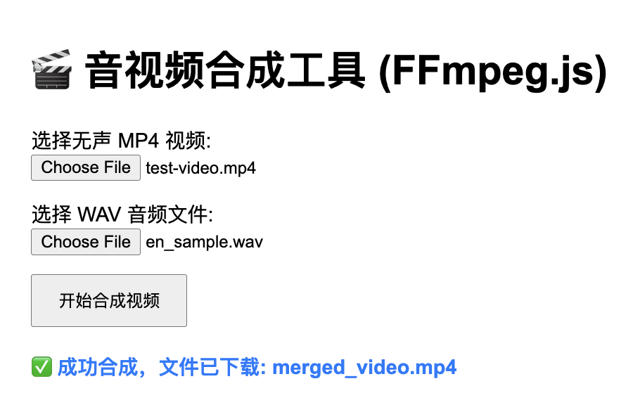

# 🎬 音视频合成工具

一个基于 FFmpeg.js 的在线音视频合成工具，可以在浏览器中直接将音频文件合成到视频文件中，无需安装任何软件。

## ✨ 项目简介

本项目使用 FFmpeg.js 在浏览器端实现音视频合成功能，支持将 WAV 音频文件与 MP4 视频文件进行合成，生成包含音频轨道的新视频文件。整个处理过程完全在客户端进行，保护用户隐私，无需上传文件到服务器。

### 主要特性

- 🌐 **纯前端处理**：所有音视频处理都在浏览器中完成
- 🔒 **隐私保护**：文件不会上传到服务器，完全本地处理
- ⚡ **快速合成**：使用视频流复制，只重新编码音频，速度更快
- 📱 **现代浏览器支持**：支持 Chrome、Firefox 等现代浏览器
- 🎯 **简单易用**：直观的用户界面，操作简单

## 📸 效果图



## 🚀 如何运行

### 环境要求

- Node.js 14+ 
- 现代浏览器（Chrome 68+, Firefox 79+）

### 安装步骤

1. **克隆项目**
   ```bash
   git clone <repository-url>
   cd video-audio-merge
   ```

2. **安装依赖**
   ```bash
   npm install
   ```

3. **启动服务器**
   ```bash
   npm start
   ```

4. **打开浏览器**
   
   访问 `http://localhost:3000`

### 使用方法

1. **选择视频文件**：点击"选择无声 MP4 视频"按钮，选择一个 MP4 格式的视频文件
2. **选择音频文件**：点击"选择 WAV 音频文件"按钮，选择一个 WAV 格式的音频文件
3. **开始合成**：点击"开始合成视频"按钮
4. **等待处理**：首次使用会下载 FFmpeg 核心文件，请耐心等待
5. **下载结果**：合成完成后会自动下载合成后的视频文件

## 🛠️ 技术栈

- **前端**：HTML5, JavaScript (ES6+)
- **音视频处理**：FFmpeg.js 0.11.0
- **服务器**：Node.js (原生 HTTP 模块)
- **文件处理**：浏览器 File API

## 📋 支持的格式

- **输入视频**：MP4 格式
- **输入音频**：WAV 格式  
- **输出视频**：MP4 格式（H.264 + AAC）

## ⚙️ 技术原理

1. **文件读取**：使用 File API 读取用户选择的文件
2. **虚拟文件系统**：将文件写入 FFmpeg.js 的虚拟文件系统
3. **音视频合成**：执行 FFmpeg 命令进行合成
   - 视频流：直接复制（`-c:v copy`）
   - 音频流：重新编码为 AAC（`-c:a aac`）
4. **文件下载**：从虚拟文件系统读取结果并触发下载

## 🔧 FFmpeg 命令说明

### 基础合成命令（当前实现）
```bash
ffmpeg -i input_video.mp4 -i input_audio.wav \
       -c:v copy -c:a aac \
       -map 0:v:0 -map 1:a:0 \
       -shortest \
       output.mp4
```

### 高级用法：指定时间段合成

如果你需要将音频合成到视频的特定时间段（比如从第1秒到第3秒），可以使用以下命令：

#### 1. 音频插入到指定时间段
```bash
# 将音频从视频的第1秒开始合成，持续2秒
ffmpeg -i input_video.mp4 -i input_audio.wav \
       -c:v copy -c:a aac \
       -filter_complex "[1:a]adelay=1000|1000[delayed]; [0:a][delayed]amix=inputs=2:duration=first[audio]" \
       -map 0:v:0 -map "[audio]" \
       output.mp4
```

#### 2. 裁剪音频后合成
```bash
# 先裁剪音频（取第0秒到第2秒），然后从视频第1秒开始合成
ffmpeg -i input_video.mp4 -i input_audio.wav \
       -c:v copy -c:a aac \
       -filter_complex "[1:a]atrim=start=0:duration=2,adelay=1000|1000[trimmed]; [0:a][trimmed]amix=inputs=2:duration=first[audio]" \
       -map 0:v:0 -map "[audio]" \
       output.mp4
```

#### 3. 替换指定时间段的音频
```bash
# 替换视频第1秒到第3秒的音频
ffmpeg -i input_video.mp4 -i input_audio.wav \
       -c:v copy -c:a aac \
       -filter_complex "[0:a]atrim=end=1[a1]; [1:a]atrim=duration=2[a2]; [0:a]atrim=start=3[a3]; [a1][a2][a3]concat=n=3:v=0:a=1[audio]" \
       -map 0:v:0 -map "[audio]" \
       output.mp4
```

### 参数说明
- `-c:v copy`：复制视频流，无需重新编码
- `-c:a aac`：将音频重新编码为 AAC 格式
- `-map 0:v:0`：映射第一个输入的视频流
- `-map 1:a:0`：映射第二个输入的音频流
- `-shortest`：输出时长与最短输入保持一致
- `adelay=1000|1000`：延迟音频1秒（1000毫秒）
- `atrim=start=1:duration=2`：裁剪音频，从第1秒开始，持续2秒
- `amix=inputs=2`：混合两个音频流
- `concat=n=3:v=0:a=1`：连接3个音频片段

## 🌐 浏览器兼容性

| 浏览器 | 最低版本 | SharedArrayBuffer 支持 |
|--------|----------|----------------------|
| Chrome | 68+ | ✅ |
| Firefox | 79+ | ✅ |
| Safari | 15.2+ | ✅ |
| Edge | 79+ | ✅ |

## 🚨 注意事项

- 首次使用需要下载约 20MB 的 FFmpeg 核心文件
- 处理大文件时可能需要较长时间
- 建议在稳定的网络环境下使用
- 某些浏览器可能需要启用 SharedArrayBuffer 支持

## 📝 开发说明

### 项目结构

```
video-audio-merge/
├── index.html          # 主页面
├── app.js             # 核心逻辑
├── server.js          # Node.js 服务器
├── package.json       # 项目配置
├── images/            # 图片资源
│   └── merge.png      # 效果图
└── README.md          # 项目说明
```

### 开发模式

```bash
# 安装 nodemon 用于开发
npm install -g nodemon

# 开发模式启动（文件变化自动重启）
npm run dev
```

## 🤝 贡献

欢迎提交 Issue 和 Pull Request 来改进这个项目！

## 📄 许可证

MIT License

---

**享受音视频合成的乐趣！** 🎉